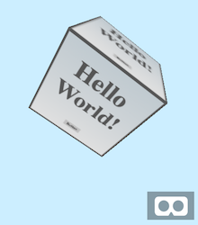

# aframe-htmltexture-component

[](https://preview.npmjs.com/package/aframe-htmltexture-component)
[](https://github.com/scenevr/aframe-htmltexture-component)

HTML Texture component for A-Frame VR.



## Usage

Register `aframe-draw-component` first and import `aframe-htmltexture-component` 

```js
import drawComponent from 'aframe-draw-component'
AFRAME.registerComponent("draw", drawComponent.component);

import 'aframe-htmltexture-component'
```

In your template :

```html
<div id="hello">
  Hello <b>World !</b>
</div>

<a-entity geometry="primitive: box" htmltexture="asset: #hello" position="0 2 -4" draw="width: 128; height: 512;"></a-entity>
```

## See also 

 - [aframe-draw-component](https://github.com/maxkrieger/aframe-draw-component)
 - [aframe-html-shader](https://github.com/mayognaise/aframe-html-shader)


